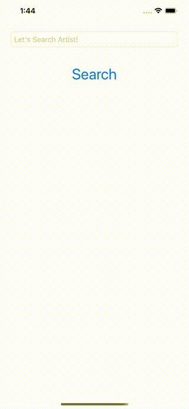

# TCA Spotify Music Searcher
Simple spotify music searcher using [TCA](https://github.com/pointfreeco/swift-composable-architecture).

## ScreenShot

## Usage
1. Register [Spotify Developer Platform](https://developer.spotify.com/).
2. Get Token.
3. Paste to `authHeader["Authorization"]` in `SpotifyApiRepository.swift`
4. Build Project.
